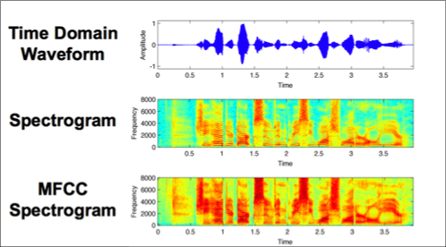

  
# Embedded AI Final Project
## Autoencoder for Audio Anomaly Detection

 

This project utilizes an autoencoder model trained on the [DCASE "Unsupervised Anomalous Sound Detection for Machine Condition Monitoring under Domain Shifted Conditions"](https://www.kaggle.com/datasets/pythonafroz/electrical-motor-anomaly-detection-from-sound-data) data set.

For testing purposes, only the *fan* data was used instead of the gearbox, valve or pump data. This was to decrease overall model size and make it easier to create an autoencoder, as this project is a proof of concept for running neural networks on edge devices.

The model was designed with the [Raspberry Pi 3 B+](https://www.raspberrypi.com/products/raspberry-pi-3-model-b-plus/) in mind, and was tested directly on device. This was to demonstrate the effectiveness of my model compression/quantization as well as the efficiency of the model's inference step when processing audio. The Raspberry Pi 3 B+ has the following specifications:

| **CPU**             | **RAM**          | **Storage**  | **LAN**             | **USB**    | **OS**          |
|---------------------|------------------|--------------|---------------------|------------|-----------------|
| 64-Bit SoC @ 1.4GHz | 1GB LPDDR2 SDRAM | 64GB MicroSD | 2.4GHz wireless LAN | 4x USB 2.0 | Raspberry Pi OS |

  

For the tech stack itself, a variety of platforms, deployment environments & interpreters were used to get the model up and running:

| **Language** | **Primary ML Package** | **Quantization Package/Interpreter** | **IDE(s)**                                                      | **Misc. Packages**                            |
|--------------|------------------------|--------------------------------------|-----------------------------------------------------------------|-----------------------------------------------|
| Python       | TensorFlow (Keras)     | TFLite (TensorFlow Lite)             | Visual Studio Code (inference) Google Colab Notebook (training) | Numpy, librosa, sounddevice, tkinter, psutil  |

 

Finally, the microphone. This part was tricky, as adapting the microphone to fit the nature of the data and give good results was tricky. Thankfully, the microphone used had multiple settings for gain and pattern selection. The microphone used in this project was the [Blue Yeti](https://www.logitechg.com/en-us/shop/p/yeti-premium-usb-microphone), which has a default
input frequency of 44100 Hz, which, of course, had to be resampled during inference (more on that later).

## Use Cases and Safety

 

The general use case for an autoencoder such as this would be that of [predictive maintenance](https://www.ibm.com/think/topics/predictive-maintenance), which involves using AI models and sensors to determine the health of equipment. In this particular case, monitoring
the overall health of a desk fan is not entirely practical but demonstrates how such a model can be run on a small, cheap device such as a Raspberry Pi. Regardless, should a user want to run this model to monitor a fan, it absolutely can be done (with some adjustments, of course - more on that later).

There are plenty of safety concerns regarding an anomaly detection model, especially in the area of audio privacy. To have a persistent monitor for a device, the audio stream must always be running, meaning that potential conversations or monologue may be recorded. While
the audio itself is never actually stored anywhere, the simple fact of having persistent audio input means there could be plenty of security issues. For example, if a malicious actor would choose to gain access to the microphone/input device, they could easily capture or listen
in on the audio stream that the model is reading in. With this in mind, if an anomaly detection model is to ever be used in practice, all potential occupants of the space that the input device resides in **must** be notified of the audio stream.

 

## Autoencoders and MFCC

 

An autoencoder model is a unique model type, since it does not look for correct classification (accuracy) or MSE (in the traditional sense). Instead, autoencoders will only be trained on audio that is considered "normal" - then, using an input stream or validation set, the
encoder will attempt to reconstruct the signal and compares it to its training data, generating a **reconstruction MSE**. This MSE metric helps in determining the proper **threshold** for the model, which is essentially a limit for how high the MSE the model will allow before it detects
an anomaly. 

This works in three steps - the autoencoder compresses the data into "bottleneck" representation, then learns the most effective and essential parts of the data. Then, the model will attempt to reconstruct the data based on what was learned, and will then output the 
reconstruction loss function (MSE in this case). 

While it would be convenient to have the model directly ingest .wav files, doing so is impractical and impossible in most cases. In order for the model to understand the data, there are a handful of methods that may be employed to allow for the model to ingest:

| **Mel-Spectrogram**                                                                                                                                                                       | **Mel-Frequency Cepstral Coefficients (MFCC)**                                                                                                                                                                                                                                                         | **Waveform**                                                                                                          |
|-------------------------------------------------------------------------------------------------------------------------------------------------------------------------------------------|--------------------------------------------------------------------------------------------------------------------------------------------------------------------------------------------------------------------------------------------------------------------------------------------------------|-----------------------------------------------------------------------------------------------------------------------|
| Easy to interpret visually, applies log-mel filter banks to the spectrogram to mimic human hearing. Often computationally expensive with high dimensionality. **(Time-frequency domain)** | Much less intuitive to interpret visually. Applies the DCT function to the  log-mel spectrogram to create a "spectrum of the spectrum", allowing for more focus on shape and less on finer details. Less dimensionality, less computationally expensive & ideal for edge devices.  **(Time-cepstrum domain)** | Representative of amplitude over time, not particularly desirable for neural networks and learning. **(Time domain)** |

 

While the general intuition would be to use waveform to find changes in frequency (thus indicating anomalous behavior), it is generally much less effective than using the other two spectrogram techniques. The reasoning for this is because of the highly intense computational cost of processing raw audio as well as the sensitivity to noise and artifacts that it may have. While it is the most "detailed" approach, it is definitely not suitable in this particular scenario (with an edge device).
Ultimately, MFCC was chosen for the audio processing, as it allows for faster and more efficient computation. Generally, especially for CNNs, it can have weaker performance but is much less computationally expensive due to the lower dimensionality. Even with this, MFCC is still a great choice and gave great results (shown further down). For more complex environments that do not involve a singular device or (relatively) low-noise environments, mel-spectrogram may be more desirable.

 

*Image courtesy of [Vital Capacities](https://vitalcapacities.com/7613/)*

 

When actually processing the data, a number of decisions had to be made. These decisions were all related to normalizing the data; the length of each clip (and padding, if necessary), the number of coefficients to extract for reconstruction, and the frequency. Normalizing the data here is crucial, since we want to create a base truth for the autoencoder to know
what the "normal" sounds of a fan are. By using the [librosa python package](https://librosa.org/doc/latest/index.html), converting the .wav files from the Kaggle dataset into workable, ingestible data was trivial. Additionally, a new column/axis was added at the end of the input tensors to represent the channel count.

| **Frequency (Hz)** | **MFCC Count** | **Duration Clip (s)** | **Window Step Count (after padding)** |
|--------------------|----------------|-----------------------|---------------------------------------|
| 16000              | 40             | 2                     | 64                                    |

 

Then, the final step to handling the data is to pad the height and width of the data to become divisible by 4. The reasoning for this is since most maxpool, stride and downscale operations require compatible dimensionality. The actual operation involves taking the data, calculating how much padding is needed and applying it using numpy vectorization to add zeroes wherever needed. Now, the final dimension of each input tensor is **(40, 64, 1)**.

 

## Model Training Process

 

As it can be found in the **.ipynb file, located in the notebooks folder**, the model was trained as an autoencoder. There are numerous steps to actually performing this training, especially with creating the various layers of the CNN. Creating an autoencoder requires a specific structure, so the layers had to be selected carefully.
To start, the model is put through 3 convolution layers using a 3x3 filter, each with an increasingly large number of filters of 16, 32 and 74. The first two layers use a stride of 2 to decrease dimensionality and perform the first step in creating a successful autoencoder. Then, a global average pool is done to prepare the bottleneck, and the bottleneck is converted into a 32 neuron dense layer to prepare the reconstruction. After this, the reconstruction begins by converting the data into a (10, 16, 64) tensor, then again to the original (40, 64, 1) tensor. Then, the model essentially works backwards using transpose Conv2D layers which help bring the data back to the original size. Then, the reconstructed data is compared to the original input data to calculate the reconstruction error. This is a lot to take in, so here is a visualization of the model and each layer:

